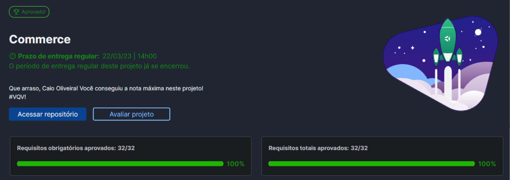

<h1 align="center">🍃  MongoDB Commerce  🍔</h1>

## Description

It's a project to learn about MongoDB,
and how to make operations using MQL(
<strong>M</strong>ongoDB-
<strong>Q</strong>uery-
<strong>L</strong>anguage),
like we were managing a fast food restaurant.

## 💻 Tecnologies used
>[![JavaScript][JavaScript]][JavaScript-url]
[![mongo][mongo]][mongo-url]

## ✏️ What i learned

- How to Use MQL to create a MongoDB database, and how to manipulate and access its data

# 🎖️ Grade 🎖️

[JavaScript]: https://img.shields.io/badge/-JavaScript-F7DF1E?style=for-the-badge&logo=node.js&logoColor=black
[JavaScript-url]: https://www.javascript.com

[mongo]: https://img.shields.io/badge/mongodb-47A248?style=for-the-badge&logo=mongodb&logoColor=black
[mongo-url]: https://www.mongodb.com/
